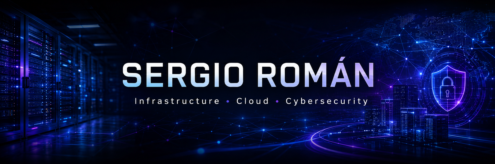

  

  
  
  
  
  

# 👋 Hey, I'm Sergio Román

## 🏗️ Infrastructure • Cloud • Networking • Cybersecurity

Passionate about designing, deploying and securing enterprise infrastructure environments.

I enjoy building real-world laboratories focused on virtualization, self-hosting, cloud technologies, networking, observability, automation and cybersecurity.

Currently specializing in Linux, Windows Server, Docker, Infrastructure Monitoring and Enterprise Networking while following a long-term roadmap towards Cloud and Security Engineering.

🐧 Linux • 🪟 Windows Server • ☁️ Cloud • 🌐 Networking • 🔐 Cybersecurity • 🐳 Docker • 📊 Observability

 

---

# 🚀 Flagship Project

# 🏢 Enterprise Infrastructure Laboratory (ASIR)

A complete enterprise-grade infrastructure environment designed and deployed during professional internships to simulate real-world IT operations.

## 🗺️ Infrastructure & Network Topology

> **Why show the blueprint?** Because engineering is about visualization. Here is the architecture map of the corporate environment deployed in this project.

  

### 🏗️ Architecture Overview
* **Virtualization Core:** Proxmox VE bare-metal platform managing a multi-VM infrastructure.
* **Hybrid Layout:** Seamless orchestration between dedicated Windows/Linux enterprise servers and light-weight Raspberry Pi services.
* **Segregation:** Centralized management architecture managing segmented networks.

📌 **Repository:** [Explore Configuration & Code Files](https://github.com/SergioRomanGutierrez/Laboratorio-ASIR)

---

## ⚙️ Core Capabilities Deployed

### 🔐 Identity & Access Management (IAM)
* **Windows Server:** Domain Controller deployment utilizing **Active Directory**.
* **Governance:** Structural organization using Organizational Units (OUs) and strict **Group Policy Objects (GPO)** execution.
* **Security:** Granular User and Permission management following the principle of least privilege.

### 🌐 Infrastructure & Web Layer
* **Core Core Services:** Operational deployment of DNS, DHCP, and secure internal FTP servers.
* **Containerization:** **Docker Engine** environment orchestrated cleanly via Portainer.
* **Traffic Control:** **NGINX Reverse Proxy** acting as the secure gateway to host and isolate multiple web applications (*SMR, ASIR, IA, Cybersecurity*).

### 🗄️ Relational Databases
* **Oracle Database 21c:** Enterprise data tier leveraging Container Databases (CDB) and Pluggable Databases (PDB).
* **PostgreSQL:** Production-ready open-source relational engine.
* **Backend Automation:** Integration with **Excel VBA administrative client app** deploying automation procedures, analytical triggers, and rigorous database auditing.

### 📊 Full-Stack Observability
* **Telemetry Collection:** Monitoring stack powered by **Prometheus**, **Node Exporter**, and **cAdvisor** for live container and node metrics.
* **Visualization:** High-end dashboards built in **Grafana** and lightweight real-time host tracking with **Netdata** for total environment visibility.

### 🛡️ Hardening & Audit Exercises
* **Inspection:** Deep packet and network analysis utilizing **Wireshark** traffic analysis.
* **Scanning:** Security reconnaissance, service discovery, and port mapping via **Nmap**.
* **Offensive Assessment:** Controlled auditing routines using **Kali Linux** suites to validate security baselines.

---

## 🛠️ Main Tech Stack

| Category | Technologies |
| :--- | :--- |
| **Operating Systems** |     |
| **Virtualization** |   |
| **Containers** |   |
| **Databases** |   |
| **Monitoring** |    |
| **Networking** |    |
| **Security** |    |
| **Web Services** |   |
| **Automation** |     |

---

# 🎯 Certifications & Learning Path

## 🚧 In Progress / Scheduled

### Microsoft
* AI-900 Azure AI Fundamentals
* Microsoft Copilot Fundamentals
* AZ-900 Azure Fundamentals

### AWS
* AWS Certified Cloud Practitioner

---

## 📅 Planned

### Microsoft Azure
* AZ-104 Azure Administrator • AZ-305 Azure Solutions Architect • AZ-500 Azure Security Engineer • SC-100 Cybersecurity Architect

### Amazon Web Services
* AWS Solutions Architect Associate • AWS SysOps Administrator Associate • AWS Security Specialty • AWS Solutions Architect Professional

### Cisco
* CCNA • CCNP Enterprise • CCNP Security

### Cybersecurity
* CompTIA Security+ • eJPT • PNPT • CISSP

---

# 📈 GitHub Statistics

  
  

  

---

# 📫 Contact

  
  
  

---

### 🤝 Let's Connect

Interested in:
* ☁️ Cloud Computing • 🌐 Enterprise Networking • 🏗️ Infrastructure Engineering • 🔐 Cybersecurity • 🐳 DevOps & Automation • 📊 Observability & Monitoring

Always open to connecting with professionals, engineers and technology enthusiasts.
